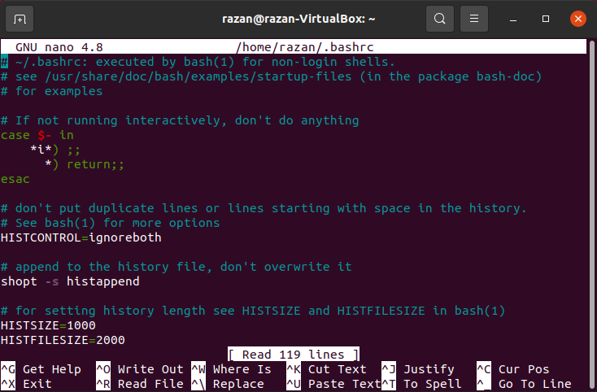
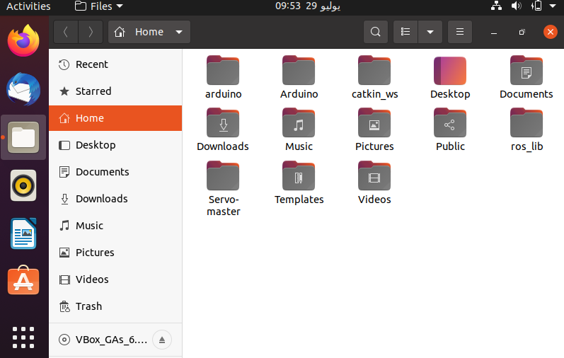
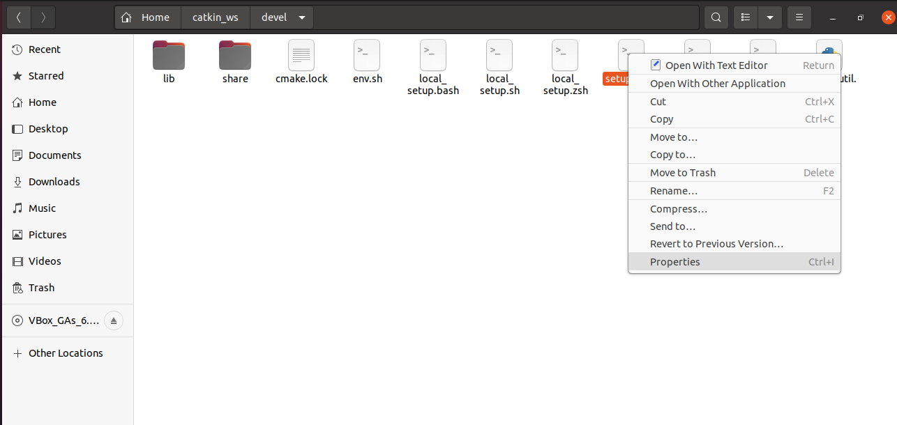
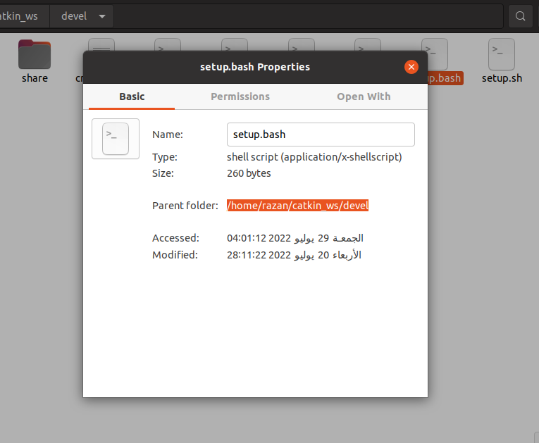
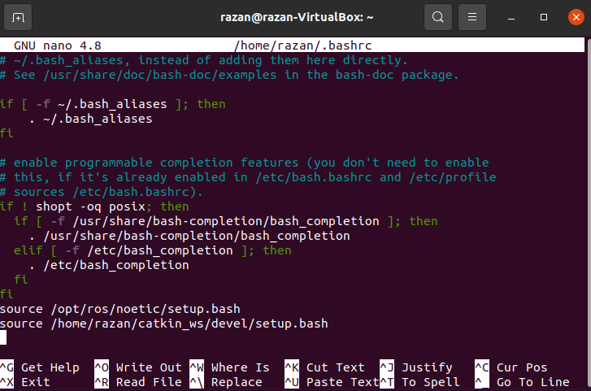
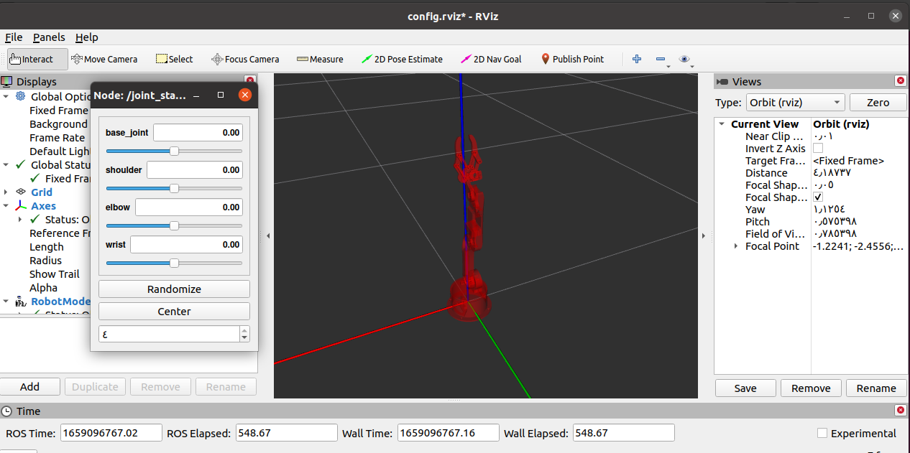

### You want to control your robot ? take it step by step ! 👌 

Start by simulating the robot arm on your device. To do that, you need to follow some steps after downloading ROS on Ubuntu which I have explained in this repository: https://github.com/Razany98/ROS-Installation 

##### :red_circle: Notes: The written commands below are for ROS noetic, so if you are using another distribution change the word 'noetic' to the one you are using.

- #### 1 - The first thing you need to do is creating a workspace to install the arm package on it. 

Copy/Paste the following commands: 
  
- $ source /opt/ros/noetic/setup.bash 
- $ mkdir -p ~/catkin_ws/src (Here I named my workspace catkin_ws, you can choose it to whatever you want)
- $ cd ~/catkin_ws/
- $ catkin_make

Now you've created a workspace to put your arm package in. :clap:

- #### 2 - Download the arm package: 

- $ git clone https://github.com/smart-methods/arduino_robot_arm.git  

then go to the catkin workspace you created by the command: 
- $ cd ~/catkin_ws ; to install **ROS dependencies**. 

To do so, copy/paste the following commands: 

- $ rosdep install --from-paths src --ignore-src -r -y
- $ sudo apt-get install ros-noetic-moveit
- $ sudo apt-get install ros-noetic-joint-state-publisher ros-noetic-joint-state-publisher-gui
- $ sudo apt-get install ros-noetic-gazebo-ros-control joint-state-publisher
- $ sudo apt-get install ros-noetic-ros-controllers ros-noetic-ros-control

Now paste this command in your terminal:
- $ sudo nano ~/.bashrc 

it will open this page: 

Now go to catkin workspace folder: 

Choose devel. Right click on the **setup.bash** file, and choose properties: 

You can see the location as: /home/yourname/catkin_ws/devel, or wherever you've created your workspace in, and copy it. 

In my case it is /home/razan/catkin_ws/devel 

 

Go back to the terminal, pull down to the last line and paste: 
- $ source /home/yourname/catkin_ws/devel/setup.bash 
:arrow_right:  or "source -- /The path you've copied -- /setup.bash" 

To finish, press: 

:one: ctrl + O

:two: Enter 

:three: ctrl + X 

Finally, to update the source file of bashrc paste: 
- $ source ~/.bashrc 
- $ roslaunch robot_arm_pkg check_motors.launch 

This will open Rviz program where you can simulate and control your robot arm :+1:

